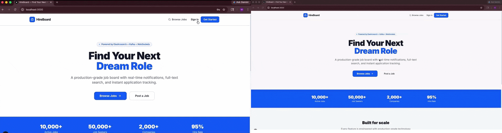

# HireBoard — Job Board Platform

> A production-grade job board platform demonstrating the full spectrum of modern backend engineering: authentication, search, payments, and real-time communication.

[](https://nodejs.org)
[](https://nextjs.org)
[](https://postgresql.org)
[](https://elastic.co)
[](https://kafka.apache.org)
[](https://stripe.com)
[](https://socket.io)
[](https://docker.com)

---

## Overview

HireBoard is a full-stack SaaS job board where job seekers search and apply for roles, and employers post listings and manage applicants. The project is deliberately over-engineered relative to its scale — the goal is demonstrating production patterns, not building the minimum viable product.

```
Next.js (SSR) ──→ Node.js API ──→ PostgreSQL   (source of truth)
                              ──→ Redis         (caching)
                              ──→ Elasticsearch (full-text search)
                              ──→ Kafka         (async indexing)
                              ──→ Socket.io     (real-time notifications)
                              ──→ Stripe        (subscription billing)
```

---

## Demo
Both dashboards running simultaneously — employer on the left, seeker on the right.

- 🏢 Employer logs in and posts a new job listing
- 🔍 Seeker searches **"senior dev"** and finds the listing via Elasticsearch fuzzy matching
- 📝 Seeker applies — employer moves status to **Reviewing**
- ✅ Employer accepts — seeker receives a **real-time notification instantly**



---

## Features

### Authentication
- JWT access tokens (15 minute expiry) stored in JavaScript memory — never localStorage
- Refresh tokens (7 day expiry) in httpOnly cookies — inaccessible to JavaScript, XSS-resistant
- **Refresh token rotation** — every refresh issues a new token and invalidates the old one
- **Reuse detection** — if a rotated token is presented again, all sessions are immediately invalidated
- Axios response interceptor silently refreshes expired tokens and retries the original request

### Search
- Elasticsearch inverted index with field boosting: title^3, company^2, description
- Fuzzy matching with AUTO fuzziness — typos like "Reakt" match "React"
- Filter context for job type, location, salary range — cached by Elasticsearch, no scoring overhead
- Relevance sorting when searching, chronological sorting when browsing

### Payments
- Stripe Checkout hosted payment page — card data never touches our servers
- Subscription lifecycle managed entirely through webhook events
- Employer userId embedded in Stripe metadata — survives weeks between checkout and cancellation
- Webhook signature verification prevents spoofed payment events
- Cancel-at-period-end — employers keep Pro access until their billing period expires

### Real-time
- Socket.io WebSocket connections authenticated with the same JWT as HTTP requests
- Personal rooms per user (`user:42`) — targeted notifications, no broadcasting
- Application status updates pushed instantly to seekers without polling
- Graceful degradation — if user is offline, they see updated status on next REST fetch

### Architecture
- Role-based access control — employers and seekers have completely separate capabilities
- Ownership checks in the service layer, not just middleware — defence in depth
- Soft deletes for jobs — preserves application history and analytics
- Status state machine for applications — `pending → reviewing → accepted/rejected`

---

## Tech Stack

| Layer | Technology | Why |
|-------|-----------|-----|
| Frontend | Next.js 14 App Router | SSR for job listing SEO, React for interactivity |
| Styling | Tailwind CSS v4 | Utility-first, fast iteration |
| HTTP Client | Axios + Interceptors | Silent token refresh, consistent error handling |
| API Server | Node.js + Express | Familiar, lightweight, excellent ecosystem |
| Primary Database | PostgreSQL 15 | Relational integrity, ACID transactions |
| Search Engine | Elasticsearch 8 | Inverted index, relevance scoring, fuzzy matching |
| Message Queue | Apache Kafka | Decoupled async job indexing |
| Real-time | Socket.io | WebSocket with fallback, room-based targeting |
| Payments | Stripe | Hosted checkout, webhook lifecycle management |
| Infrastructure | Docker Compose | One command local environment |

---

## Getting Started

### Prerequisites

- [Node.js 18+](https://nodejs.org)
- [Docker Desktop](https://docker.com/products/docker-desktop)
- [Stripe account](https://stripe.com) (free, test mode)

### Installation

```bash
# Clone the repository
git clone https://github.com/yourusername/hireboard
cd hireboard

# Start all infrastructure
docker-compose up -d
# Starts: PostgreSQL, Redis, Elasticsearch, Kibana, Kafka, Zookeeper, Kafka UI
# Note: Elasticsearch takes ~30 seconds to initialise

# Backend setup
cd backend
npm install
cp .env.example .env
# Fill in JWT secrets and Stripe keys (see Environment Variables below)
npm run dev

# Seed the database with realistic dummy data (new terminal)
npm run seed

# Frontend setup (new terminal)
cd frontend
npm install
cp .env.local.example .env.local
npm run dev
```

Open [http://localhost:3000](http://localhost:3000)

### Environment Variables

```bash
# backend/.env

# Server
PORT=3001
NODE_ENV=development
FRONTEND_URL=http://localhost:3000

# PostgreSQL
DB_HOST=localhost
DB_PORT=5432
DB_NAME=hireboard
DB_USER=postgres
DB_PASSWORD=postgres

# Elasticsearch
ES_HOST=http://localhost:9200

# Kafka
KAFKA_BROKER=localhost:9092

# JWT — generate strong random secrets
JWT_ACCESS_SECRET=generate_a_strong_random_secret_here
JWT_REFRESH_SECRET=generate_a_different_strong_secret_here
JWT_ACCESS_EXPIRY=15m
JWT_REFRESH_EXPIRY=7d

# Stripe — from dashboard.stripe.com/test/apikeys
STRIPE_SECRET_KEY=sk_test_...
STRIPE_WEBHOOK_SECRET=whsec_...   # from: stripe listen --forward-to localhost:3001/api/payments/webhook
STRIPE_PRO_PRICE_ID=price_...    # create a $49/month product in Stripe dashboard
```

```bash
# frontend/.env.local
NEXT_PUBLIC_API_URL=http://localhost:3001
```

### Stripe Local Setup

```bash
# Install Stripe CLI
# Windows: scoop install stripe
# macOS:   brew install stripe/stripe-cli/stripe

# Authenticate
stripe login

# Forward webhooks to local server (keep this running)
stripe listen --forward-to localhost:3001/api/payments/webhook
# Copy the webhook signing secret to STRIPE_WEBHOOK_SECRET in .env
```

### Seed Data

```bash
cd backend
npm run seed
```

Creates realistic test data:

| Role | Email | Password |
|------|-------|----------|
| Employer (Google) | hiring@google.com | password123 |
| Employer (Stripe) | jobs@stripe.com | password123 |
| Employer (Airbnb) | careers@airbnb.com | password123 |
| Employer (Vercel) | talent@vercel.com | password123 |
| Job Seeker | john@example.com | password123 |
| Job Seeker | sarah@example.com | password123 |
| Job Seeker | mike@example.com | password123 |

All employer accounts are seeded with Pro plan subscriptions.

---

## API Reference

### Authentication

| Method | Endpoint | Description |
|--------|----------|-------------|
| `POST` | `/api/auth/register` | Create account (seeker or employer) |
| `POST` | `/api/auth/login` | Login, returns access token + sets refresh cookie |
| `POST` | `/api/auth/refresh` | Rotate refresh token, return new access token |
| `POST` | `/api/auth/logout` | Invalidate refresh token, clear cookie |
| `GET` | `/api/auth/me` | Get current user (requires auth) |

### Jobs

| Method | Endpoint | Auth | Description |
|--------|----------|------|-------------|
| `GET` | `/api/jobs` | Optional | List active jobs (paginated) |
| `GET` | `/api/jobs/:id` | Optional | Get job by ID or slug |
| `GET` | `/api/jobs/mine` | Employer | Get employer's own listings |
| `POST` | `/api/jobs` | Employer | Create job listing |
| `PUT` | `/api/jobs/:id` | Employer (owner) | Update job |
| `DELETE` | `/api/jobs/:id` | Employer (owner) | Close job listing |

### Search

| Method | Endpoint | Auth | Description |
|--------|----------|------|-------------|
| `GET` | `/api/search` | Optional | Full-text search with filters |

Query parameters: `query`, `location`, `jobType`, `salaryMin`, `salaryMax`, `page`, `limit`

### Applications

| Method | Endpoint | Auth | Description |
|--------|----------|------|-------------|
| `POST` | `/api/applications/:jobId` | Seeker | Apply to a job |
| `GET` | `/api/applications/mine` | Seeker | Get own applications |
| `GET` | `/api/applications/:id` | Seeker/Employer | Get single application |
| `GET` | `/api/applications/job/:jobId` | Employer (owner) | Get all applicants |
| `PUT` | `/api/applications/:id/status` | Employer (owner) | Update status |

### Payments

| Method | Endpoint | Auth | Description |
|--------|----------|------|-------------|
| `POST` | `/api/payments/create-checkout-session` | Employer | Start Stripe checkout |
| `GET` | `/api/payments/subscription` | Employer | Get subscription status |
| `POST` | `/api/payments/cancel` | Employer | Cancel at period end |
| `POST` | `/api/payments/webhook` | Stripe | Webhook event handler |

---

## Architecture Deep Dive

### Why Elasticsearch alongside PostgreSQL?

PostgreSQL has built-in full-text search. For a job board at modest scale it works. Elasticsearch is overkill — and that's the point. The project demonstrates:

- **Inverted index** vs B-tree index for text search
- **Relevance scoring** — title matches rank higher than description matches
- **Fuzzy matching** — typo tolerance without client-side workarounds
- **Decoupled indexing** — PostgreSQL is the source of truth, Elasticsearch is a search projection

The Kafka consumer pattern means Elasticsearch can be rebuilt from scratch at any time by replaying events.

### Why refresh token rotation?

JWTs cannot be revoked. A stolen access token is valid until it expires. The mitigation:

```
Access token:  15 minute expiry, in memory
               Stolen → attacker has 15 minutes maximum
               Cannot refresh without the httpOnly cookie

Refresh token: 7 day expiry, httpOnly cookie
               JavaScript cannot read it (XSS-resistant)
               Rotated on every use — reuse triggers full logout
```

If an attacker somehow obtains a refresh token and uses it after the legitimate user has already rotated it, the server detects reuse. It invalidates every session for that account — both the attacker and the user are logged out. The user re-authenticates; the attacker cannot.

### Why embed userId in the refresh token?

```
Token format: "{userId}:{randomBytes}"
Example:      "42:a3f9b2c1d4e5..."
Stored in DB: SHA256(token)  ← one-way hash, not the token itself
```

When reuse is detected and the token has already been deleted from the database, we still need to know which user to invalidate. The userId prefix in the token lets us extract the user without a database lookup — even after the record is gone.

### Why Stripe webhooks instead of redirect-based confirmation?

The `success_url` redirect fires before Stripe confirms payment processing. A network failure between Stripe and your server could result in a user redirected to a success page but their account never upgraded.

Webhooks are separate from the user's browser session. Stripe retries webhook delivery with exponential backoff for 72 hours. The upgrade only happens after `checkout.session.completed` is received and verified — not when the user's browser is redirected.

### WebSocket authentication

Socket.io connections use the same JWT access token as HTTP requests:

```javascript
const socket = io('http://localhost:3001', {
  auth: { token: accessToken }
})
```

The server verifies the token in Socket.io middleware before the connection is established. An invalid token results in a `connect_error` — the connection never opens. Each authenticated user joins a personal room (`user:{id}`) so notifications are targeted, not broadcast.

---

## Monitoring

| Service | URL | Description |
|---------|-----|-------------|
| Frontend | http://localhost:3000 | Next.js application |
| Backend API | http://localhost:3001 | Express server |
| Elasticsearch | http://localhost:9200 | ES REST API |
| Kibana | http://localhost:5601 | Elasticsearch dashboard |
| Kafka UI | http://localhost:8080 | View topics and messages |

---

## Project Structure

```
hireboard/
├── docker-compose.yml
├── backend/
│   └── src/
│       ├── config/
│       │   ├── db.js                 PostgreSQL connection pool
│       │   ├── elasticsearch.js      ES client + index mapping
│       │   ├── kafka.js              Producer + indexer consumer
│       │   └── socket.js             Socket.io server + auth middleware
│       ├── controllers/
│       │   ├── auth.controller.js
│       │   ├── job.controller.js
│       │   ├── application.controller.js
│       │   └── payment.controller.js
│       ├── middleware/
│       │   ├── auth.middleware.js    verifyJWT, requireRole, optionalAuth
│       │   └── rateLimiter.middleware.js
│       ├── routes/
│       │   ├── auth.js
│       │   ├── jobs.js
│       │   ├── applications.js
│       │   ├── search.js
│       │   └── payments.js
│       ├── services/
│       │   ├── authService.js        JWT, bcrypt, token rotation
│       │   ├── jobService.js         CRUD, subscription checks
│       │   ├── applicationService.js Status machine, notifications
│       │   ├── searchService.js      Elasticsearch query builder
│       │   └── paymentService.js     Stripe checkout, webhooks
│       ├── utils/
│       │   ├── ApiError.js
│       │   ├── ApiResponse.js
│       │   └── asyncHandler.js
│       ├── seed.js
│       └── index.js
└── frontend/
    ├── app/
    │   ├── layout.js
    │   ├── page.js                   Landing page (SSR)
    │   ├── (auth)/
    │   │   ├── login/page.js
    │   │   └── register/page.js
    │   ├── jobs/
    │   │   ├── page.js               Job listings (SSR + search)
    │   │   └── [id]/page.js          Job detail (SSR)
    │   ├── dashboard/
    │   │   ├── layout.js
    │   │   ├── page.js
    │   │   ├── jobs/
    │   │   ├── applicants/
    │   │   ├── applications/
    │   │   └── billing/
    │   └── pricing/page.js
    ├── components/
    │   ├── Providers.jsx             AuthContext + SocketContext
    │   ├── Header.jsx
    │   ├── SearchForm.jsx
    │   ├── ApplyButton.jsx
    │   └── NotificationBell.jsx
    └── lib/
        └── api.js                    Axios instance + interceptors
```

---

## System Design Discussion Points

### Scaling the search tier
Elasticsearch is configured with 1 shard and 0 replicas for local development. In production: 3 primary shards for parallelism, 1 replica per shard for redundancy and read throughput. The Kafka consumer pattern means any number of ES nodes can be added and the index rebuilt from the event log.

### Scaling the database tier
The current schema has no horizontal sharding. At scale, jobs could be partitioned by `employer_id` or `created_at` range. Read replicas would handle search-adjacent queries. The Elasticsearch tier already offloads most read traffic for job discovery.

### Token storage trade-offs

| Storage | XSS Risk | CSRF Risk | Persists Refresh |
|---------|----------|-----------|-----------------|
| localStorage | High | Low | Yes |
| httpOnly Cookie | None | Medium (mitigated by SameSite=Strict) | Yes |
| Memory | None | None | No (cleared on refresh) |

We use httpOnly cookies for refresh tokens and memory for access tokens. The combination gives XSS resistance for the long-lived token and no persistence risk for the short-lived one.

### Webhook idempotency
Stripe guarantees at-least-once delivery. The same `checkout.session.completed` event may arrive twice. Our handlers are idempotent — setting `plan = 'pro'` on an already-Pro account is a no-op. In a more sensitive flow (e.g. crediting a wallet), you would store processed event IDs and skip duplicates explicitly.

---

## License

MIT
